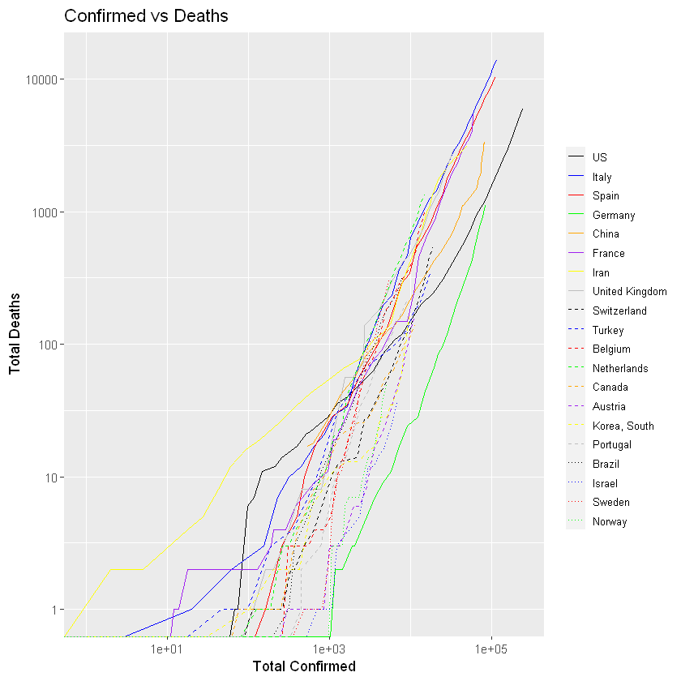
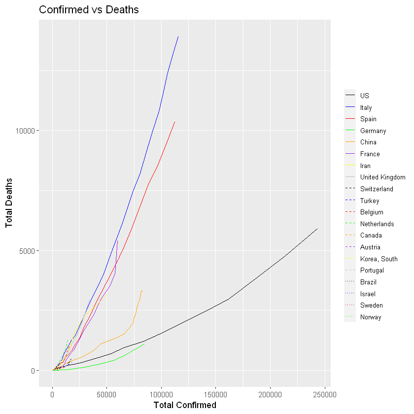
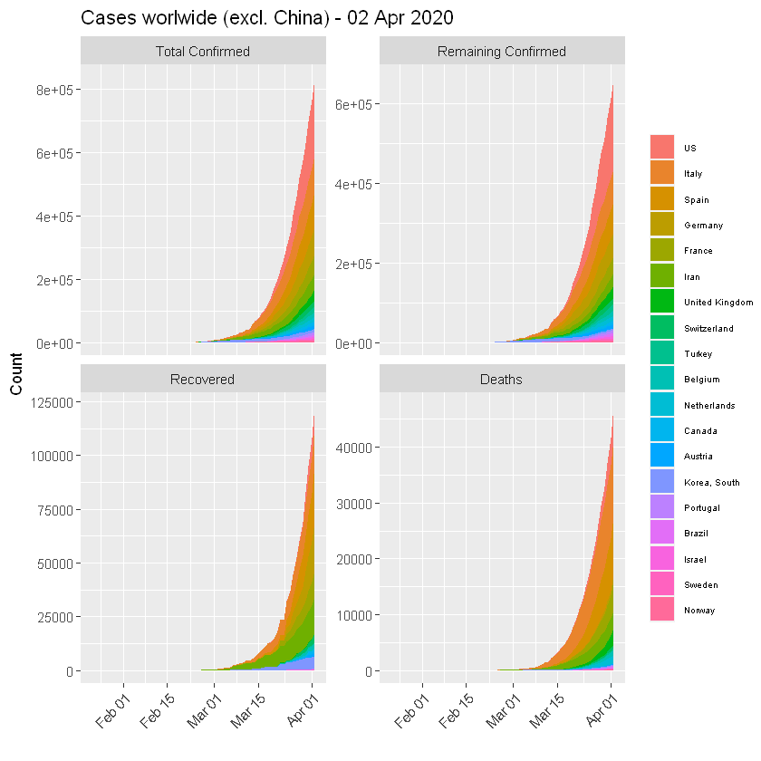
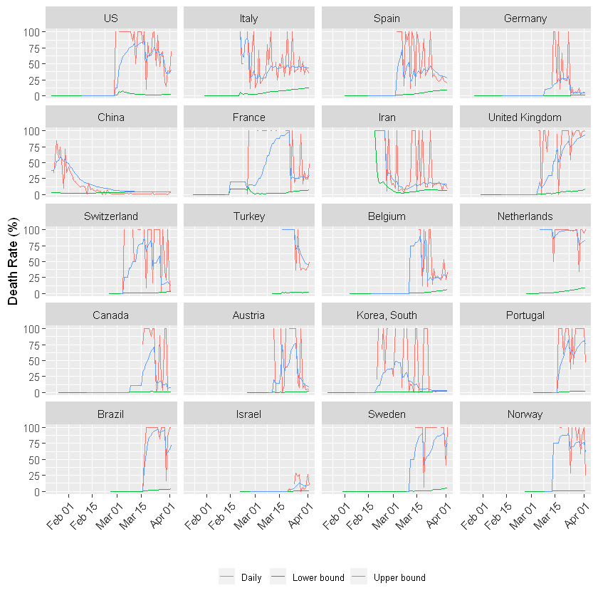
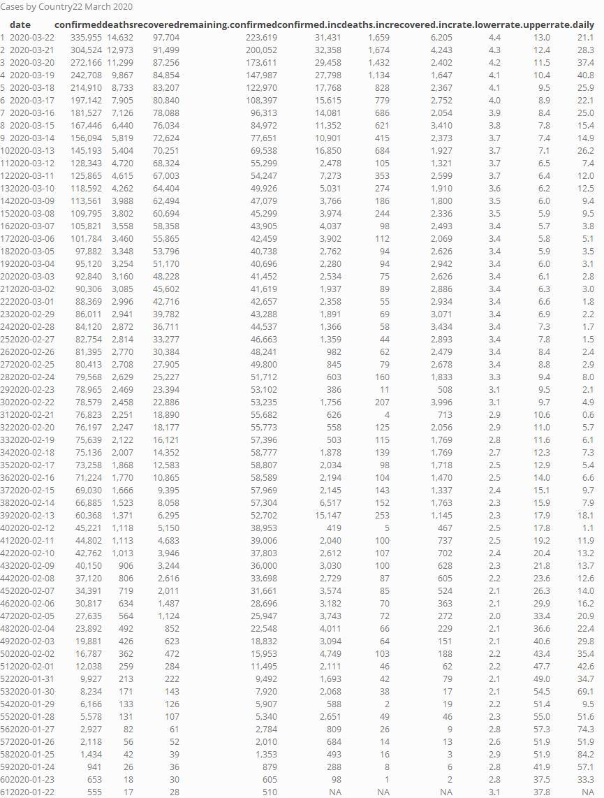
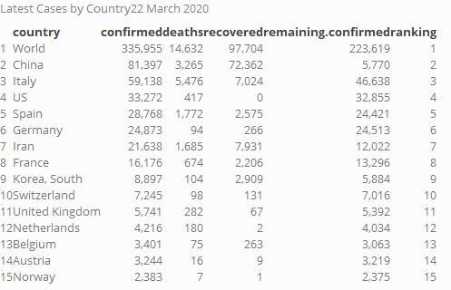

# Coronavirus disease (COVID-19) data analysis Worldwide 

(Archived)

(_last update: 3 April 2020_)

Ongoing data science pipeline to process, analyse and visualise COVID-19 pandemia data. The intented goal is to illustrate with data cleaning, processing and visualisation pipelines, the most update packages and libraries for doing Data Science with R

The current outbreak of coronavirus disease (COVID-19) that was first reported from Wuhan, China, on 31 December 2019.

Since mid-february, [Johns Hopkins CSSE](https://www.arcgis.com/apps/opsdashboard/index.html#/bda7594740fd40299423467b48e9ecf6) reports the number of diagnoses with the coronavirus and their residence on a daily base. The data contains the total number of positively tested (confirmed), deaths and recovery patients. ~The [raw dataset](https://github.com/CSSEGISandData/COVID-19/tree/master/csse_covid_19_data/csse_covid_19_time_series) can be found on the github repository. This dataset is daily updated.

## This is a developing story :exclamation: Daily updates :exclamation:

Datasets:

  - :page_facing_up: [Confirmed](https://github.com/CSSEGISandData/COVID-19/blob/master/csse_covid_19_data/csse_covid_19_time_series/time_series_covid19_confirmed_global.csv) 
  - :page_facing_up: [Recovered](https://github.com/CSSEGISandData/COVID-19/blob/master/csse_covid_19_data/csse_covid_19_time_series/time_series_covid19_recovered_global.csv) 
  - :page_facing_up: [Deaths](https://github.com/CSSEGISandData/COVID-19/blob/master/csse_covid_19_data/csse_covid_19_time_series/time_series_covid19_deaths_global.csv) 

## Tips for improvements

Suggest on this project is appreciated. I am looking for new features for the data pipelines.

See [data science pipeline](src/script.R) for technical details regarding data collection and cleaning.

## :chart_with_upwards_trend: Graphs globally

The following graphs show the development of Coronavirus consequences on a daily basis. The [outputs](/outputs) are updated on an daily basis and are generated automatically.

### More visualisation outputs

TOP 20 Countries

Death rate!

### Ranking Tables _[Deprecated]_

Case by country

Top 15

## Reference and reproducible output

The pipeline is inspired by [Yanchang Zhao](http://www.rdatamining.com/docs/Coronavirus-data-analysis-world.pdf). Citation:

_COVID-19 Data Analysis with Tidyverse and Ggplot2 – Worldwide. RDataMining.com, 2020._

Output for Jupyter [COVID-Descriptives](Data%20Science%20in%20R%20workshop.ipynb)

PDF Format [COVID-Descriptives](outputs/Data-Science-FAIR---COVID-19--.pdf)

## Contact

Please connect with me c.utrilla.guerrero@gmail.com
