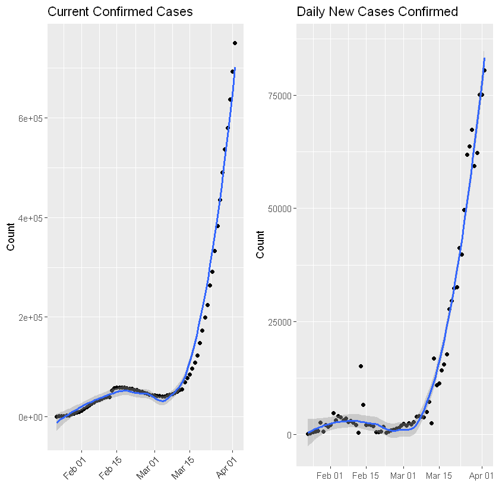
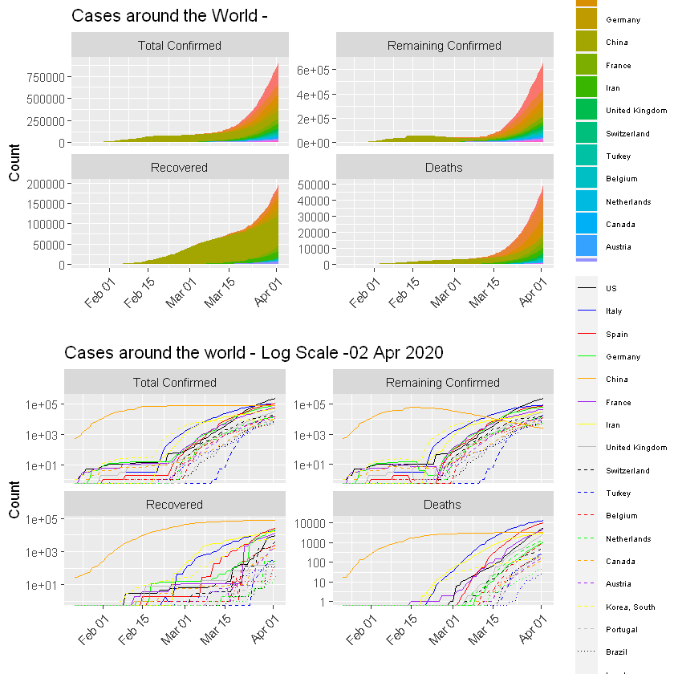

---

"COVID-19 Open Research Data Analysis"
---

This is an analysis report of the Novel Coronavirus (COVID-19)
Aim for data processing, visualisation and statstics.
Data provided by Johns Hopkins University [github](https://github.com/CSSEGISandData/COVID-19)

Try executing this chunk by clicking the *Run* button within the chunk or by placing your cursor inside it and pressing *Ctrl+Shift+Enter*. 


```R
# Source code: http://yanchang.rdatamining.com/

# R Packages:
library(magrittr) # pipline operations
library(lubridate) # date operation
library(tidyverse) # data science pips
library(gridExtra) # grid based plots
library(kableExtra) # build HTML and LaTeX tables
library(dplyr)
```

    Warning message:
    "package 'magrittr' was built under R version 3.6.3"Warning message:
    "package 'lubridate' was built under R version 3.6.3"
    Attaching package: 'lubridate'
    
    The following object is masked from 'package:base':
    
        date
    
    Warning message:
    "package 'tidyverse' was built under R version 3.6.3"-- Attaching packages --------------------------------------- tidyverse 1.3.0 --
    v ggplot2 3.3.0     v purrr   0.3.3
    v tibble  2.1.3     v dplyr   0.8.5
    v tidyr   1.0.2     v stringr 1.4.0
    v readr   1.3.1     v forcats 0.5.0
    Warning message:
    "package 'ggplot2' was built under R version 3.6.3"Warning message:
    "package 'tibble' was built under R version 3.6.3"Warning message:
    "package 'tidyr' was built under R version 3.6.3"Warning message:
    "package 'readr' was built under R version 3.6.3"Warning message:
    "package 'purrr' was built under R version 3.6.3"Warning message:
    "package 'dplyr' was built under R version 3.6.3"Warning message:
    "package 'stringr' was built under R version 3.6.3"Warning message:
    "package 'forcats' was built under R version 3.6.3"-- Conflicts ------------------------------------------ tidyverse_conflicts() --
    x lubridate::as.difftime() masks base::as.difftime()
    x lubridate::date()        masks base::date()
    x tidyr::extract()         masks magrittr::extract()
    x dplyr::filter()          masks stats::filter()
    x lubridate::intersect()   masks base::intersect()
    x dplyr::lag()             masks stats::lag()
    x purrr::set_names()       masks magrittr::set_names()
    x lubridate::setdiff()     masks base::setdiff()
    x lubridate::union()       masks base::union()
    Warning message:
    "package 'gridExtra' was built under R version 3.6.3"
    Attaching package: 'gridExtra'
    
    The following object is masked from 'package:dplyr':
    
        combine
    
    Warning message:
    "package 'kableExtra' was built under R version 3.6.3"
    Attaching package: 'kableExtra'
    
    The following object is masked from 'package:dplyr':
    
        group_rows
    
    


```R
# Loading data
# At first, three CSV files, are downloaded and saved as local files
# and then loaded into R

# source data files
filenames <- c('time_series_19-covid-Confirmed.csv',
               'time_series_19-covid-Deaths.csv', 
               'time_series_19-covid-Recovered.csv')
url.path <- paste0('https://raw.githubusercontent.com/CSSEGISandData/COVID-19/',
                   'master/csse_covid_19_data/csse_covid_19_time_series/')

#download files to local folder
download <- function(filename) {
  url <- file.path(url.path, filename)
  dest <- file.path('./data', filename)
  download.file(url, dest)
}
bin <- lapply(filenames, download)


# load data into R
data.confirmed <- read.csv('./data/time_series_19-covid-Confirmed.csv')
data.deaths <- read.csv('./data/time_series_19-covid-Deaths.csv')
data.recovered <- read.csv('./data/time_series_19-covid-Recovered.csv')

# check dimension of data confirmed
dim(data.confirmed)
```


<ol class=list-inline>
	<li>487</li>
	<li>65</li>
</ol>


```R
# check time frame of the data
n.col <- ncol(data.confirmed) # 58 variables
# get dates from column names
dates <- names(data.confirmed)[5:n.col] %>% substr(2,8) %>% mdy()
range(dates)

min.date <- min(dates)
max.date <- max(dates)
max.date.txt <- max.date %>% format('%d %B %Y')
# last update on 16 March 2020 max.date

# Data Preparation steps:
# 1.From wide to long format
# 2.Aggregate by country
# 3. merge into a signe dataset
# cleaning and transformation
cleanData <- function(data) {
  ## remove some columns
  data %<>% select(-c(Province.State, Lat, Long)) %>% rename(country=Country.Region) 
  ## convert from wide to long format
  data %<>% gather(key=date, value=count, -country) 
  ## convert from character to date 
  data %<>% mutate(date = date %>% substr(2,8) %>% mdy()) 
  ## aggregate by country 
  data %<>% group_by(country, date) %>% summarise(count=sum(count)) %>% as.data.frame()
  return(data)
}
# clean the three datasets
data.confirmed %<>% cleanData() %>% rename(confirmed=count)  
data.deaths %<>% cleanData() %>% rename(deaths=count)
data.recovered %<>% cleanData() %>% rename(recovered=count)

# merge above 3 datasets into one, by country and date
data <- data.confirmed %>% merge(data.deaths) %>% merge(data.recovered)

# countries/regions with confirmed cases (excl cruise ships)
countries <- data %>% pull(country) %>% setdiff('Cruise Ship')

```


<ol class=list-inline>
	<li><time datetime="2020-01-22">2020-01-22</time></li>
	<li><time datetime="2020-03-22">2020-03-22</time></li>
</ol>


```R

# first 10 records when it first broke out in China
# Last 10 records when it first broke out in Spain
data %>% filter(country =='Spain')%>% tail(10)

```


<table>
<thead><tr><th></th><th scope=col>country</th><th scope=col>date</th><th scope=col>confirmed</th><th scope=col>deaths</th><th scope=col>recovered</th></tr></thead>
<tbody>
	<tr><th scope=row>52</th><td>Spain     </td><td>2020-03-13</td><td> 5232     </td><td> 133      </td><td> 193      </td></tr>
	<tr><th scope=row>53</th><td>Spain     </td><td>2020-03-14</td><td> 6391     </td><td> 195      </td><td> 517      </td></tr>
	<tr><th scope=row>54</th><td>Spain     </td><td>2020-03-15</td><td> 7798     </td><td> 289      </td><td> 517      </td></tr>
	<tr><th scope=row>55</th><td>Spain     </td><td>2020-03-16</td><td> 9942     </td><td> 342      </td><td> 530      </td></tr>
	<tr><th scope=row>56</th><td>Spain     </td><td>2020-03-17</td><td>11748     </td><td> 533      </td><td>1028      </td></tr>
	<tr><th scope=row>57</th><td>Spain     </td><td>2020-03-18</td><td>13910     </td><td> 623      </td><td>1081      </td></tr>
	<tr><th scope=row>58</th><td>Spain     </td><td>2020-03-19</td><td>17963     </td><td> 830      </td><td>1107      </td></tr>
	<tr><th scope=row>59</th><td>Spain     </td><td>2020-03-20</td><td>20410     </td><td>1043      </td><td>1588      </td></tr>
	<tr><th scope=row>60</th><td>Spain     </td><td>2020-03-21</td><td>25374     </td><td>1375      </td><td>2125      </td></tr>
	<tr><th scope=row>61</th><td>Spain     </td><td>2020-03-22</td><td>28768     </td><td>1772      </td><td>2575      </td></tr>
</tbody>
</table>


```R

## Cases for the Whole World
# counts for worldwide
data.world <- data %>% group_by(date) %>%
  summarise(country='World',
            confirmed=sum(confirmed),
            deaths=sum(deaths),
            recovered=sum(recovered))

data %<>% rbind(data.world)

# remaining confirmed cases
data %<>% mutate(remaining.confirmed = confirmed - deaths - recovered)
```


```R
# Daily Increases and Death Rates

# rate.upper = total deaths and recovered cases
# rate.lower = total deaths and confirmed cases
# expected death rate is to be between above rates
# rate.daily =daily deaths and recovered cases

## sort by country and date
data %<>% arrange(country,date)
# daily increases of deaths and recovered cases
# set NA to increase on day1
n <- nrow(data)
day1 <- min(data$date) # set NA day1
data %<>% mutate(confirmed.inc=ifelse(date ==day1,NA, confirmed - lag(confirmed, n=1)),
                 deaths.inc=ifelse(date ==day1,NA,deaths - lag(deaths, n=1)),
                 recovered.inc=ifelse(date ==day1,NA,recovered - lag(recovered, n=1)))

# death rate base on total deaths and recovered cases
data %<>% mutate(rate.upper = (100 *deaths / (deaths + recovered)) %>% round(1))
# lower bound: death rate based on total confirmed cases
data %<>% mutate(rate.lower = (100 * deaths / confirmed) %>% round(1))
# death rate based on number f death/recovered on every single day
data %<>% mutate(rate.daily = (100 * deaths.inc / (deaths.inc + recovered.inc)) %>% round(1))
```


```R
# Visualisation
# After preparing the data, we portrait it in various graphs

# TOP Ten Countries
# ranking by confirmed cases
data.latest <- data %>% filter(date ==max(date)) %>%
                                select(country, date, confirmed, deaths, recovered, remaining.confirmed) %>%
                                mutate(ranking = dense_rank(desc(confirmed)))
# top 10 countries incl 11 World
top.countries <- data.latest %>% filter(ranking <= 11) %>%
  arrange(ranking) %>% pull(country) %>% as.character()
top.countries %>% setdiff('World') %>% print()

## add 'Others'
top.countries %<>% c('Others')
## put all others in a single group of 'Others'
df <- data.latest %>% filter(!is.na(country) & country!= 'World')%>%
  mutate(country=ifelse(ranking <= 11, as.character(country), 'Others')) %>%
  mutate(country=country %>% factor(levels = c(top.countries)))
df %<>% group_by(country) %>% summarise(confirmed=sum(confirmed))  
```

     [1] "China"          "Italy"          "US"             "Spain"         
     [5] "Germany"        "Iran"           "France"         "Korea, South"  
     [9] "Switzerland"    "United Kingdom"
    


```R
### TABLE
# percentage and label
df %<>% mutate(per = (100*confirmed/sum(confirmed)) %>% round(1)) %>%
                 mutate(txt = paste0(country, ': ', confirmed, '(', per, '%)'))
df %>% ggplot(aes(fill=country)) +
  geom_bar(aes(x ='', y = per), stat= 'identity') +
  coord_polar('y', start =0) +
  xlab('') + ylab('Percentage (%)') +
  labs(title=paste0('Top 10 Countries with Most Confirmed Cases - ', max.date.txt)) +
  scale_fill_discrete(name='Country', labels = df$txt) +
  theme(legend.title = element_blank(), legend.text = element_text((size=7)))
   
```

    Warning message in grid.Call(C_stringMetric, as.graphicsAnnot(x$label)):
    "font family not found in Windows font database"Warning message in grid.Call(C_textBounds, as.graphicsAnnot(x$label), x$x, x$y, :
    "font family not found in Windows font database"


```R
# Table
data.latest %>% filter(country %in% top.countries) %>% select(-c(date, ranking)) %>%
                                                                arrange(desc(confirmed))
```


<table>
<thead><tr><th scope=col>country</th><th scope=col>confirmed</th><th scope=col>deaths</th><th scope=col>recovered</th><th scope=col>remaining.confirmed</th></tr></thead>
<tbody>
	<tr><td>World         </td><td>335955        </td><td>14632         </td><td>97704         </td><td>223619        </td></tr>
	<tr><td>China         </td><td> 81397        </td><td> 3265         </td><td>72362         </td><td>  5770        </td></tr>
	<tr><td>Italy         </td><td> 59138        </td><td> 5476         </td><td> 7024         </td><td> 46638        </td></tr>
	<tr><td>US            </td><td> 33272        </td><td>  417         </td><td>    0         </td><td> 32855        </td></tr>
	<tr><td>Spain         </td><td> 28768        </td><td> 1772         </td><td> 2575         </td><td> 24421        </td></tr>
	<tr><td>Germany       </td><td> 24873        </td><td>   94         </td><td>  266         </td><td> 24513        </td></tr>
	<tr><td>Iran          </td><td> 21638        </td><td> 1685         </td><td> 7931         </td><td> 12022        </td></tr>
	<tr><td>France        </td><td> 16176        </td><td>  674         </td><td> 2206         </td><td> 13296        </td></tr>
	<tr><td>Korea, South  </td><td>  8897        </td><td>  104         </td><td> 2909         </td><td>  5884        </td></tr>
	<tr><td>Switzerland   </td><td>  7245        </td><td>   98         </td><td>  131         </td><td>  7016        </td></tr>
	<tr><td>United Kingdom</td><td>  5741        </td><td>  282         </td><td>   67         </td><td>  5392        </td></tr>
</tbody>
</table>


```R
                                                        
 # Comparison across Countries
# convert from wide to long format, for drawing area plot
data.long <- data %>%
  select(c(country, date, confirmed, remaining.confirmed, recovered, deaths)) %>%
  gather(key = type, value = count, -c(country,date))
# set for factor levels to show them in a desirable order
data.long %<>% mutate(type =recode_factor(type, confirmed= 'Confirmed',
                                          remaining.confirmed = 'Remaining Confirmed',
                                          recovered= 'Recovered',
                                          deaths='Deaths'))
# plot cases by type
df <- data.long %>% filter(country %in% top.countries) %<>%
  mutate(country=country %>% factor(levels=c(top.countries)))


### CASES AROUND WORLD
p <- df%>% filter(country !='World') %>%
  ggplot(aes(x=date, y=count)) + xlab('') + ylab('Count') +
  theme(legend.title=element_blank(),
        legend.text = element_text(size=6),
        legend.key.size=unit(0.6, 'cm'),
        axis.text.x=element_text(angle = 45, hjust=1)) +
  facet_wrap(~type, ncol = 2, scale='free_y')
# area plot
plot1 <- p + geom_area(aes(fill=country)) +
  labs(title='Cases around the World')
# line plot and in log scale
linetypes <- rep(c('solid','dashed','dotted'), each=8)
colors <- rep(c('black','blue','red','green','orange', 'purple', 'yellow', 'grey'), 3)
plot2 <- p + geom_line(aes(color=country, linetype=country)) +
  scale_linetype_manual(values = linetypes) +
  scale_color_manual(values = colors) +
  labs(title = 'Cases around the world - Log Scale') +
  scale_y_continuous(trans = 'log10')
# shows two plots together
grid.arrange(plot1, plot2, ncol=1)

# Plot: excluding China
p <- df%>% filter(!(country %in% c('World', 'China'))) %>%
  ggplot(aes(x=date, y=count)) + xlab('') + ylab('Count') +
  theme(legend.title=element_blank(),
        legend.text = element_text(size=6),
        legend.key.size=unit(0.6, 'cm'),
        axis.text.x=element_text(angle = 45, hjust=1)) +
  facet_wrap(~type, ncol = 2, scale='free_y')
# area plot
plot1 <- p + geom_area(aes(fill=country)) +
  labs(title='Cases around the World (excl. China)')
# line plot and in log scale
linetypes <- rep(c('solid','dashed','dotted'), each=8)
colors <- rep(c('black','blue','red','green','orange', 'purple', 'yellow', 'grey'), 3)
plot2 <- p + geom_line(aes(color=country, linetype=country)) +
  scale_linetype_manual(values = linetypes) +
  scale_color_manual(values = colors) +
  labs(title = 'Cases around the world (excl. China) - Log Scale') +
  scale_y_continuous(trans = 'log10')
# shows two plots together
grid.arrange(plot1, plot2, ncol=1)
```

    Warning message:
    "Transformation introduced infinite values in continuous y-axis"Warning message:
    "Transformation introduced infinite values in continuous y-axis"


```R

## If The Netherland is not top 20, add it in and remove 'Others'
if(!('Netherlands' %in% top.countries)) {
  top.countries %<>% setdiff('Others') %>% c('Netherlands')
  df <- data.long %>% filter(country %in% top.countries) %>%
    mutate(country=country %>% factor(levels = c(top.countries)))
}

# cases by country - area plot
df %>% filter(type != 'Confirmed') %>%
  ggplot(aes(x=date, y=count, fill=type)) +
  geom_area(alpha=0.5) +
  labs(title = paste0('COVID - 19 Cases in Countries TOP 20 (incl. Netherlands) - ', max.date.txt)) +
  scale_fill_manual(values=c('yellow','green','red')) +
  theme(legend.title=element_blank(), legend.position='bottom',
        plot.title= element_text(size = 9),
        axis.title.x=element_blank(),
        axis.title.y = element_blank(),
        legend.key.size = unit(0.3, 'cm'),
        strip.text.x = element_text(size=7),
        axis.text=element_text(size = 7),
        axis.text.x = element_text(angle=45, hjust=1)) +
  facet_wrap(~country, ncol=4, scale='free_y') #+ scale_y_continuous(trans = 'log10')

# cases by country - log case
df %>% filter(type != 'Confirmed') %>%
  ggplot(aes(x=date, y=count, color=type)) +
  geom_line() +
  labs(title = paste0('COVID - 19 Cases in Countries TOP 20 Log (incl. Netherlands) - ', max.date)) +
  scale_fill_manual(values=c('red','green','blue')) +
  theme(legend.title=element_blank(), legend.position='bottom',
        plot.title= element_text(size = 9),
        axis.title.x=element_blank(),
        axis.title.y = element_blank(),
        legend.key.size = unit(0.3, 'cm'),
        strip.text.x = element_text(size=7),
        axis.text=element_text(size = 7),
        axis.text.x = element_text(angle=45, hjust=1)) +
  facet_wrap(~country, ncol=4, scale='free_y') + scale_y_continuous(trans = 'log10')
```

    Warning message:
    "Transformation introduced infinite values in continuous y-axis"





```R

### Current confirmed cases:
#data.test <- data %>% filter(country %in% c('Italy', 'Spain', 'Netherlands'))
data %<>% filter(country== 'World')
n <- nrow(data)
```


```R

# current confirmed and it is increase with worldwide case
plot1 <- ggplot(data, aes(x = date, y=remaining.confirmed)) +
  geom_point() + geom_smooth(span=0.3) +
  xlab('') + ylab('count') + labs(title= 'Current Confirmed Cases') +
  theme(axis.text = element_text(angle = 45, hjust=1))
plot2 <- ggplot(data, aes(x =date, y=confirmed.inc)) +
  geom_point() + geom_smooth(span=0.3) +
  xlab('') + ylab('Count') + labs(title= 'Increase in current confirmed cases') +
  theme (axis.text.x = element_text(angle=45, hjust =1))
# show plot 1 and 2 side by side
grid.arrange(plot1, plot2, ncol=2)

```

    `geom_smooth()` using method = 'loess' and formula 'y ~ x'
    `geom_smooth()` using method = 'loess' and formula 'y ~ x'
    Warning message:
    "Removed 1 rows containing non-finite values (stat_smooth)."Warning message:
    "Removed 1 rows containing missing values (geom_point)."


```R
# Deaths and recovery cases
plot1 <- ggplot(data,aes(x=date, y=deaths)) +
  geom_point() + geom_smooth() +
  xlab('') + ylab('Count') + labs(title = 'Deaths') +
  theme(axis.text.x = element_text(angle = 45, hjust=1))
plot2 <- ggplot(data,aes(x=date, y=recovered)) +
  geom_point() + geom_smooth() +
  xlab('') + ylab('Count') + labs(title = 'Recovered Cases') +
  theme(axis.text.x = element_text(angle = 45, hjust=1))
plot3 <- ggplot(data,aes(x=date, y=deaths.inc)) +
  geom_point() + geom_smooth() +
  xlab('') + ylab('Count') + labs(title = 'Increase in Deaths') +
  theme(axis.text.x = element_text(angle = 45, hjust=1))
plot4 <- ggplot(data,aes(x=date, y=recovered.inc)) +
  geom_point() + geom_smooth() +
  xlab('') + ylab('Count') + labs(title = 'Increase Recovered cases') +
  theme(axis.text.x = element_text(angle = 45, hjust=1))
# shows plots together
grid.arrange(plot1, plot2, plot3, plot4, nrow=2)
```

    `geom_smooth()` using method = 'loess' and formula 'y ~ x'
    `geom_smooth()` using method = 'loess' and formula 'y ~ x'
    `geom_smooth()` using method = 'loess' and formula 'y ~ x'
    Warning message:
    "Removed 1 rows containing non-finite values (stat_smooth)."Warning message:
    "Removed 1 rows containing missing values (geom_point)."`geom_smooth()` using method = 'loess' and formula 'y ~ x'
    Warning message:
    "Removed 1 rows containing non-finite values (stat_smooth)."Warning message:
    "Removed 1 rows containing missing values (geom_point)."


```R

## Deaths rates
plot1 <- ggplot(data, aes(x=date)) +
  geom_line(aes(y=rate.upper, colour='Upper bound')) +
  geom_line(aes(y=rate.lower, colour='Lower bound')) +
  geom_line(aes(y=rate.daily, colour='Daily')) +
  xlab('') + ylab('Death Rate (%)') + labs(title='Overall') +
  theme(legend.position='bottom', legend.title=element_blank(),
        axis.text.x=element_text(angle=45, hjust=1)) +
  ylim(0,90)
## insert las two weeks
plot2 <- ggplot(data[n-(14:0),], aes(x=date)) +
  geom_line(aes(y=rate.upper, colour='Upper bound')) +
  geom_line(aes(y=rate.lower, colour='Lower bound')) +
  geom_line(aes(y =rate.daily, colour= 'Daily')) +
  xlab('') + ylab('Death Rate (%)') + labs(title = 'Overall') +
  theme(legend.position='bottom', legend.title =element_blank(),
        axis.text.x=element_text(angle=45, hjust=1))
grid.arrange(plot1, plot2, nrow=1)
```

    Warning message:
    "Removed 1 row(s) containing missing values (geom_path)."





```R
# COVID-19 Cases Worldwide

datatable <- data %>% arrange(desc(date)) %>%
  select(c(date, confirmed, deaths, recovered, remaining.confirmed,
           confirmed.inc, deaths.inc, recovered.inc, rate.lower, rate.upper, rate.daily)) 


datatable %>% kable('html', booktabs=T, longtable=T, row.names=T,caption=paste0('Cases by Country', max.date.txt),format.args=list(big.mark=',')) %>%
  save_kable("outputs/table1.jpg")
datatable

```


<table>
<thead><tr><th scope=col>date</th><th scope=col>confirmed</th><th scope=col>deaths</th><th scope=col>recovered</th><th scope=col>remaining.confirmed</th><th scope=col>confirmed.inc</th><th scope=col>deaths.inc</th><th scope=col>recovered.inc</th><th scope=col>rate.lower</th><th scope=col>rate.upper</th><th scope=col>rate.daily</th></tr></thead>
<tbody>
	<tr><td>2020-03-22</td><td>335955    </td><td>14632     </td><td>97704     </td><td>223619    </td><td>31431     </td><td>1659      </td><td>6205      </td><td>4.4       </td><td>13.0      </td><td>21.1      </td></tr>
	<tr><td>2020-03-21</td><td>304524    </td><td>12973     </td><td>91499     </td><td>200052    </td><td>32358     </td><td>1674      </td><td>4243      </td><td>4.3       </td><td>12.4      </td><td>28.3      </td></tr>
	<tr><td>2020-03-20</td><td>272166    </td><td>11299     </td><td>87256     </td><td>173611    </td><td>29458     </td><td>1432      </td><td>2402      </td><td>4.2       </td><td>11.5      </td><td>37.4      </td></tr>
	<tr><td>2020-03-19</td><td>242708    </td><td> 9867     </td><td>84854     </td><td>147987    </td><td>27798     </td><td>1134      </td><td>1647      </td><td>4.1       </td><td>10.4      </td><td>40.8      </td></tr>
	<tr><td>2020-03-18</td><td>214910    </td><td> 8733     </td><td>83207     </td><td>122970    </td><td>17768     </td><td> 828      </td><td>2367      </td><td>4.1       </td><td> 9.5      </td><td>25.9      </td></tr>
	<tr><td>2020-03-17</td><td>197142    </td><td> 7905     </td><td>80840     </td><td>108397    </td><td>15615     </td><td> 779      </td><td>2752      </td><td>4.0       </td><td> 8.9      </td><td>22.1      </td></tr>
	<tr><td>2020-03-16</td><td>181527    </td><td> 7126     </td><td>78088     </td><td> 96313    </td><td>14081     </td><td> 686      </td><td>2054      </td><td>3.9       </td><td> 8.4      </td><td>25.0      </td></tr>
	<tr><td>2020-03-15</td><td>167446    </td><td> 6440     </td><td>76034     </td><td> 84972    </td><td>11352     </td><td> 621      </td><td>3410      </td><td>3.8       </td><td> 7.8      </td><td>15.4      </td></tr>
	<tr><td>2020-03-14</td><td>156094    </td><td> 5819     </td><td>72624     </td><td> 77651    </td><td>10901     </td><td> 415      </td><td>2373      </td><td>3.7       </td><td> 7.4      </td><td>14.9      </td></tr>
	<tr><td>2020-03-13</td><td>145193    </td><td> 5404     </td><td>70251     </td><td> 69538    </td><td>16850     </td><td> 684      </td><td>1927      </td><td>3.7       </td><td> 7.1      </td><td>26.2      </td></tr>
	<tr><td>2020-03-12</td><td>128343    </td><td> 4720     </td><td>68324     </td><td> 55299    </td><td> 2478     </td><td> 105      </td><td>1321      </td><td>3.7       </td><td> 6.5      </td><td> 7.4      </td></tr>
	<tr><td>2020-03-11</td><td>125865    </td><td> 4615     </td><td>67003     </td><td> 54247    </td><td> 7273     </td><td> 353      </td><td>2599      </td><td>3.7       </td><td> 6.4      </td><td>12.0      </td></tr>
	<tr><td>2020-03-10</td><td>118592    </td><td> 4262     </td><td>64404     </td><td> 49926    </td><td> 5031     </td><td> 274      </td><td>1910      </td><td>3.6       </td><td> 6.2      </td><td>12.5      </td></tr>
	<tr><td>2020-03-09</td><td>113561    </td><td> 3988     </td><td>62494     </td><td> 47079    </td><td> 3766     </td><td> 186      </td><td>1800      </td><td>3.5       </td><td> 6.0      </td><td> 9.4      </td></tr>
	<tr><td>2020-03-08</td><td>109795    </td><td> 3802     </td><td>60694     </td><td> 45299    </td><td> 3974     </td><td> 244      </td><td>2336      </td><td>3.5       </td><td> 5.9      </td><td> 9.5      </td></tr>
	<tr><td>2020-03-07</td><td>105821    </td><td> 3558     </td><td>58358     </td><td> 43905    </td><td> 4037     </td><td>  98      </td><td>2493      </td><td>3.4       </td><td> 5.7      </td><td> 3.8      </td></tr>
	<tr><td>2020-03-06</td><td>101784    </td><td> 3460     </td><td>55865     </td><td> 42459    </td><td> 3902     </td><td> 112      </td><td>2069      </td><td>3.4       </td><td> 5.8      </td><td> 5.1      </td></tr>
	<tr><td>2020-03-05</td><td> 97882    </td><td> 3348     </td><td>53796     </td><td> 40738    </td><td> 2762     </td><td>  94      </td><td>2626      </td><td>3.4       </td><td> 5.9      </td><td> 3.5      </td></tr>
	<tr><td>2020-03-04</td><td> 95120    </td><td> 3254     </td><td>51170     </td><td> 40696    </td><td> 2280     </td><td>  94      </td><td>2942      </td><td>3.4       </td><td> 6.0      </td><td> 3.1      </td></tr>
	<tr><td>2020-03-03</td><td> 92840    </td><td> 3160     </td><td>48228     </td><td> 41452    </td><td> 2534     </td><td>  75      </td><td>2626      </td><td>3.4       </td><td> 6.1      </td><td> 2.8      </td></tr>
	<tr><td>2020-03-02</td><td> 90306    </td><td> 3085     </td><td>45602     </td><td> 41619    </td><td> 1937     </td><td>  89      </td><td>2886      </td><td>3.4       </td><td> 6.3      </td><td> 3.0      </td></tr>
	<tr><td>2020-03-01</td><td> 88369    </td><td> 2996     </td><td>42716     </td><td> 42657    </td><td> 2358     </td><td>  55      </td><td>2934      </td><td>3.4       </td><td> 6.6      </td><td> 1.8      </td></tr>
	<tr><td>2020-02-29</td><td> 86011    </td><td> 2941     </td><td>39782     </td><td> 43288    </td><td> 1891     </td><td>  69      </td><td>3071      </td><td>3.4       </td><td> 6.9      </td><td> 2.2      </td></tr>
	<tr><td>2020-02-28</td><td> 84120    </td><td> 2872     </td><td>36711     </td><td> 44537    </td><td> 1366     </td><td>  58      </td><td>3434      </td><td>3.4       </td><td> 7.3      </td><td> 1.7      </td></tr>
	<tr><td>2020-02-27</td><td> 82754    </td><td> 2814     </td><td>33277     </td><td> 46663    </td><td> 1359     </td><td>  44      </td><td>2893      </td><td>3.4       </td><td> 7.8      </td><td> 1.5      </td></tr>
	<tr><td>2020-02-26</td><td> 81395    </td><td> 2770     </td><td>30384     </td><td> 48241    </td><td>  982     </td><td>  62      </td><td>2479      </td><td>3.4       </td><td> 8.4      </td><td> 2.4      </td></tr>
	<tr><td>2020-02-25</td><td> 80413    </td><td> 2708     </td><td>27905     </td><td> 49800    </td><td>  845     </td><td>  79      </td><td>2678      </td><td>3.4       </td><td> 8.8      </td><td> 2.9      </td></tr>
	<tr><td>2020-02-24</td><td> 79568    </td><td> 2629     </td><td>25227     </td><td> 51712    </td><td>  603     </td><td> 160      </td><td>1833      </td><td>3.3       </td><td> 9.4      </td><td> 8.0      </td></tr>
	<tr><td>2020-02-23</td><td> 78965    </td><td> 2469     </td><td>23394     </td><td> 53102    </td><td>  386     </td><td>  11      </td><td> 508      </td><td>3.1       </td><td> 9.5      </td><td> 2.1      </td></tr>
	<tr><td>2020-02-22</td><td> 78579    </td><td> 2458     </td><td>22886     </td><td> 53235    </td><td> 1756     </td><td> 207      </td><td>3996      </td><td>3.1       </td><td> 9.7      </td><td> 4.9      </td></tr>
	<tr><td>...</td><td>...</td><td>...</td><td>...</td><td>...</td><td>...</td><td>...</td><td>...</td><td>...</td><td>...</td><td>...</td></tr>
	<tr><td>2020-02-20</td><td>76197     </td><td>2247      </td><td>18177     </td><td>55773     </td><td>  558     </td><td>125       </td><td>2056      </td><td>2.9       </td><td>11.0      </td><td> 5.7      </td></tr>
	<tr><td>2020-02-19</td><td>75639     </td><td>2122      </td><td>16121     </td><td>57396     </td><td>  503     </td><td>115       </td><td>1769      </td><td>2.8       </td><td>11.6      </td><td> 6.1      </td></tr>
	<tr><td>2020-02-18</td><td>75136     </td><td>2007      </td><td>14352     </td><td>58777     </td><td> 1878     </td><td>139       </td><td>1769      </td><td>2.7       </td><td>12.3      </td><td> 7.3      </td></tr>
	<tr><td>2020-02-17</td><td>73258     </td><td>1868      </td><td>12583     </td><td>58807     </td><td> 2034     </td><td> 98       </td><td>1718      </td><td>2.5       </td><td>12.9      </td><td> 5.4      </td></tr>
	<tr><td>2020-02-16</td><td>71224     </td><td>1770      </td><td>10865     </td><td>58589     </td><td> 2194     </td><td>104       </td><td>1470      </td><td>2.5       </td><td>14.0      </td><td> 6.6      </td></tr>
	<tr><td>2020-02-15</td><td>69030     </td><td>1666      </td><td> 9395     </td><td>57969     </td><td> 2145     </td><td>143       </td><td>1337      </td><td>2.4       </td><td>15.1      </td><td> 9.7      </td></tr>
	<tr><td>2020-02-14</td><td>66885     </td><td>1523      </td><td> 8058     </td><td>57304     </td><td> 6517     </td><td>152       </td><td>1763      </td><td>2.3       </td><td>15.9      </td><td> 7.9      </td></tr>
	<tr><td>2020-02-13</td><td>60368     </td><td>1371      </td><td> 6295     </td><td>52702     </td><td>15147     </td><td>253       </td><td>1145      </td><td>2.3       </td><td>17.9      </td><td>18.1      </td></tr>
	<tr><td>2020-02-12</td><td>45221     </td><td>1118      </td><td> 5150     </td><td>38953     </td><td>  419     </td><td>  5       </td><td> 467      </td><td>2.5       </td><td>17.8      </td><td> 1.1      </td></tr>
	<tr><td>2020-02-11</td><td>44802     </td><td>1113      </td><td> 4683     </td><td>39006     </td><td> 2040     </td><td>100       </td><td> 737      </td><td>2.5       </td><td>19.2      </td><td>11.9      </td></tr>
	<tr><td>2020-02-10</td><td>42762     </td><td>1013      </td><td> 3946     </td><td>37803     </td><td> 2612     </td><td>107       </td><td> 702      </td><td>2.4       </td><td>20.4      </td><td>13.2      </td></tr>
	<tr><td>2020-02-09</td><td>40150     </td><td> 906      </td><td> 3244     </td><td>36000     </td><td> 3030     </td><td>100       </td><td> 628      </td><td>2.3       </td><td>21.8      </td><td>13.7      </td></tr>
	<tr><td>2020-02-08</td><td>37120     </td><td> 806      </td><td> 2616     </td><td>33698     </td><td> 2729     </td><td> 87       </td><td> 605      </td><td>2.2       </td><td>23.6      </td><td>12.6      </td></tr>
	<tr><td>2020-02-07</td><td>34391     </td><td> 719      </td><td> 2011     </td><td>31661     </td><td> 3574     </td><td> 85       </td><td> 524      </td><td>2.1       </td><td>26.3      </td><td>14.0      </td></tr>
	<tr><td>2020-02-06</td><td>30817     </td><td> 634      </td><td> 1487     </td><td>28696     </td><td> 3182     </td><td> 70       </td><td> 363      </td><td>2.1       </td><td>29.9      </td><td>16.2      </td></tr>
	<tr><td>2020-02-05</td><td>27635     </td><td> 564      </td><td> 1124     </td><td>25947     </td><td> 3743     </td><td> 72       </td><td> 272      </td><td>2.0       </td><td>33.4      </td><td>20.9      </td></tr>
	<tr><td>2020-02-04</td><td>23892     </td><td> 492      </td><td>  852     </td><td>22548     </td><td> 4011     </td><td> 66       </td><td> 229      </td><td>2.1       </td><td>36.6      </td><td>22.4      </td></tr>
	<tr><td>2020-02-03</td><td>19881     </td><td> 426      </td><td>  623     </td><td>18832     </td><td> 3094     </td><td> 64       </td><td> 151      </td><td>2.1       </td><td>40.6      </td><td>29.8      </td></tr>
	<tr><td>2020-02-02</td><td>16787     </td><td> 362      </td><td>  472     </td><td>15953     </td><td> 4749     </td><td>103       </td><td> 188      </td><td>2.2       </td><td>43.4      </td><td>35.4      </td></tr>
	<tr><td>2020-02-01</td><td>12038     </td><td> 259      </td><td>  284     </td><td>11495     </td><td> 2111     </td><td> 46       </td><td>  62      </td><td>2.2       </td><td>47.7      </td><td>42.6      </td></tr>
	<tr><td>2020-01-31</td><td> 9927     </td><td> 213      </td><td>  222     </td><td> 9492     </td><td> 1693     </td><td> 42       </td><td>  79      </td><td>2.1       </td><td>49.0      </td><td>34.7      </td></tr>
	<tr><td>2020-01-30</td><td> 8234     </td><td> 171      </td><td>  143     </td><td> 7920     </td><td> 2068     </td><td> 38       </td><td>  17      </td><td>2.1       </td><td>54.5      </td><td>69.1      </td></tr>
	<tr><td>2020-01-29</td><td> 6166     </td><td> 133      </td><td>  126     </td><td> 5907     </td><td>  588     </td><td>  2       </td><td>  19      </td><td>2.2       </td><td>51.4      </td><td> 9.5      </td></tr>
	<tr><td>2020-01-28</td><td> 5578     </td><td> 131      </td><td>  107     </td><td> 5340     </td><td> 2651     </td><td> 49       </td><td>  46      </td><td>2.3       </td><td>55.0      </td><td>51.6      </td></tr>
	<tr><td>2020-01-27</td><td> 2927     </td><td>  82      </td><td>   61     </td><td> 2784     </td><td>  809     </td><td> 26       </td><td>   9      </td><td>2.8       </td><td>57.3      </td><td>74.3      </td></tr>
	<tr><td>2020-01-26</td><td> 2118     </td><td>  56      </td><td>   52     </td><td> 2010     </td><td>  684     </td><td> 14       </td><td>  13      </td><td>2.6       </td><td>51.9      </td><td>51.9      </td></tr>
	<tr><td>2020-01-25</td><td> 1434     </td><td>  42      </td><td>   39     </td><td> 1353     </td><td>  493     </td><td> 16       </td><td>   3      </td><td>2.9       </td><td>51.9      </td><td>84.2      </td></tr>
	<tr><td>2020-01-24</td><td>  941     </td><td>  26      </td><td>   36     </td><td>  879     </td><td>  288     </td><td>  8       </td><td>   6      </td><td>2.8       </td><td>41.9      </td><td>57.1      </td></tr>
	<tr><td>2020-01-23</td><td>  653     </td><td>  18      </td><td>   30     </td><td>  605     </td><td>   98     </td><td>  1       </td><td>   2      </td><td>2.8       </td><td>37.5      </td><td>33.3      </td></tr>
	<tr><td>2020-01-22</td><td>  555     </td><td>  17      </td><td>   28     </td><td>  510     </td><td>   NA     </td><td> NA       </td><td>  NA      </td><td>3.1       </td><td>37.8      </td><td>  NA      </td></tr>
</tbody>
</table>


```R
# Latest Cases by Country - TOP confirmed cases
data.latest %>% arrange(desc(confirmed)) %>% select(-c(date)) %>% head(15) %>% kable('html', booktabs=T, longtable=T, row.names=T,caption=paste0('Latest Cases by Country', max.date.txt),format.args=list(big.mark=',')) %>%
  save_kable("outputs/table2.jpg")
```
